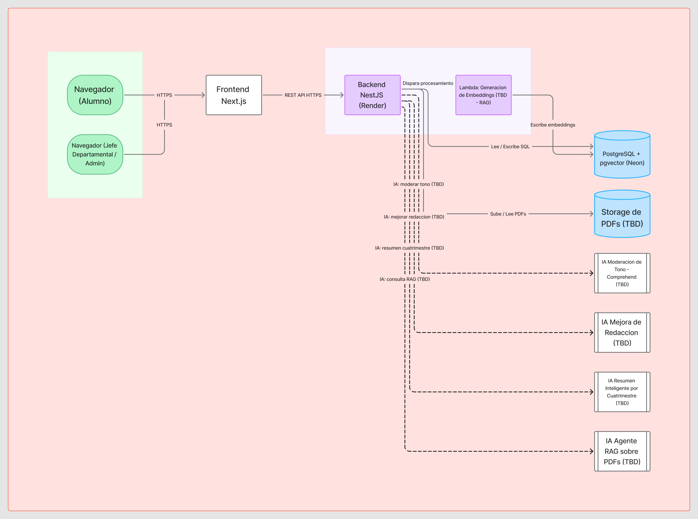

# Definición de Arquitectura

Estado: Aprobado

  
Fecha: 2026-09-27
Referencia técnica completa: [TDD-INFRA-CLOUD-H1](../tdd/TDD-INFRA-CLOUD-H1.md)

## 1. Diagrama Cloud Detallado

Diagrama editable en FigJam: [https://www.figma.com/board/plHl5Sj8IOFzbWvf3vIq2P](https://www.figma.com/board/plHl5Sj8IOFzbWvf3vIq2P)

| Componente                               | Proveedor         | Rol                                                              |
| ----------------------------------------- | ----------------- | ----------------------------------------------------------------- |
| Frontend Next.js                          | Vercel            | Aloja y sirve la aplicación web (Edge Network)                   |
| Backend NestJS                            | Render            | Web Service Node.js, proceso persistente                        |
| Lambda: Generación de Embeddings          | AWS *(TBD)*       | Genera embeddings para el agente RAG sobre PDFs                 |
| PostgreSQL + pgvector                     | Neon              | Base de datos administrada y motor de búsqueda vectorial        |
| Storage de PDFs                           | *A definir*       | Almacena el material subido (apuntes, exámenes, cronogramas)    |
| IA Moderación de Tono                     | Comprehend *(TBD)*| Modera comentarios antes de publicarse                          |
| IA Mejora de Redacción                    | *A definir*       | Sugiere mejoras de redacción al usuario                         |
| IA Resumen Inteligente por Cuatrimestre   | *A definir*       | Resumen agregado para el rol Jefe Departamental                 |
| IA Agente RAG sobre PDFs                  | *A definir*       | Responde consultas sobre el material subido                     |

Todos los renglones de IA, el worker de embeddings y el storage de PDFs son **variables
pendientes** — ver sección 4. El diagrama distingue además dos puntos de entrada del cliente:
Alumno y Jefe Departamental/Admin (sin perfil ni vista de profesor).

## 2. Setup de Infraestructura

### 2.1. Flujo de despliegue

1. Un commit se integra en `main`.
2. Vercel detecta el push y compila el workspace `front/`.
3. Render detecta el push, compila y levanta el workspace `back/`, escuchando en el puerto
 asignado por la variable `PORT`.
4. El backend se conecta a Neon mediante `DATABASE_URL` (con `sslmode=require`).
5. El frontend consulta al backend mediante `NEXT_PUBLIC_API_URL`; `GET /health` confirma que
 ambos servicios están arriba y comunicados.

### 2.2. Variables de entorno

| Servicio       | Variable              | Propósito                                     |
| -------------- | --------------------- | --------------------------------------------- |
| Render (Back)  | `DATABASE_URL`        | Cadena de conexión segura hacia Neon          |
| Render (Back)  | `PORT`                | Puerto asignado por Render para escuchar HTTP |
| Vercel (Front) | `NEXT_PUBLIC_API_URL` | URL pública del backend en Render             |

### 2.3. Decisiones clave

- **Render y no Vercel para el backend:** NestJS corre como proceso persistente
(`app.listen(port)`); forzarlo a Serverless en Vercel requiere adaptadores, limita el tiempo de
ejecución y complica el pool de conexiones a PostgreSQL.
- **Neon y no la base de Render:** el plan gratuito de Render expira las bases de datos a los 30
días; Neon ofrece nivel gratuito permanente compatible con Prisma.
- **Sin Docker en producción en esta fase:** alojar contenedores propios (EC2, Droplets, clusters)
excede el presupuesto gratuito del proyecto académico.
- Detalle completo de casos de borde (cold start, CORS, fallo SSL) en
[TDD-INFRA-CLOUD-H1 §4](../tdd/TDD-INFRA-CLOUD-H1.md#4-casos-de-borde-y-manejo-de-errores).

## 3. Repositorio Inicial con Actividad

- Repositorio: [github.com/LuliMeza/2026-CLOUD-GRUPO-22](https://github.com/LuliMeza/2026-CLOUD-GRUPO-22)
  — fork de [2026-UTN-GRUPO-01](https://github.com/Tiaguito-dev/2026-UTN-GRUPO-01) (Metodologías
  Ágiles), continuado por separado para Desarrollo Cloud, Grupo 22.
- Rama: `main` (ver [git-workflow.md](../standards/git-workflow.md))
- Historial heredado del fork desde el primer commit (2026-09-14); 16 commits a la fecha de este
  documento, sin actividad propia nueva todavía más allá del punto de fork
- Estructura: npm workspaces (`front/`, `back/`), Docker Compose para PostgreSQL local, Node.js
22.22.3 + TypeScript, NestJS + Next.js + Prisma (ver
[TDD-STACK-H1](../tdd/TDD-STACK-H1.md) y [TASK-001](../tasks/finished/TASK-001-formalizar-stack-inicial.md))

## 4. Variables Pendientes: Capacidades de IA

**Ninguna forma parte del MVP actual.** Son variables en investigación, marcadas como pendientes
en el diagrama de la sección 1 (nodos externos conectados con línea punteada al backend):

- **Moderación de tono** — analiza comentarios antes de publicarse (candidato: Amazon Comprehend).
  Fusiona lo que era el Spike 6 (ahora archivado).
- **Mejora de redacción** — sugiere una redacción alternativa sin cambiar el contenido ni la
  opinión del usuario.
- **Resumen inteligente por cuatrimestre** — agrega el estado de una comisión para el rol Jefe
  Departamental.
- **Agente RAG sobre PDFs** — responde consultas sobre el material subido (apuntes, exámenes)
  usando el pipeline de embeddings (S3/Storage → Lambda → pgvector en Neon).

Alcance de la investigación pendiente (aplica a moderación de tono y mejora de redacción):

- Definir si el objetivo es solo moderación (bloquear/filtrar) o también sugerencia activa de
mejora de redacción.
- Comparar opciones (OpenAI, modelos open source, DeepSeek, Gemini para estudiantes, Amazon
Comprehend u equivalente para análisis de sentimiento/tono) por costo, latencia, precisión en
español, facilidad de integración y privacidad de datos (¿pueden enviarse comentarios de
alumnos a un servicio externo?).
- Definir reglas de negocio de bloqueo (insultos, datos personales, discurso de odio, spam) vs.
sugerencia (tono, claridad).
- Prototipo mínimo contra 10-15 comentarios de ejemplo, comparando 1-2 opciones candidatas.
- Definir el flujo de un comentario rechazado (aviso al usuario, posibilidad de reeditar).

Entregable esperado de esa investigación: documento de comparativa, POC con resultados, decisión
final y criterios de moderación definidos. Hasta que esa decisión exista, este documento no fija
proveedor ni costo asociado a ninguna de estas cuatro piezas.